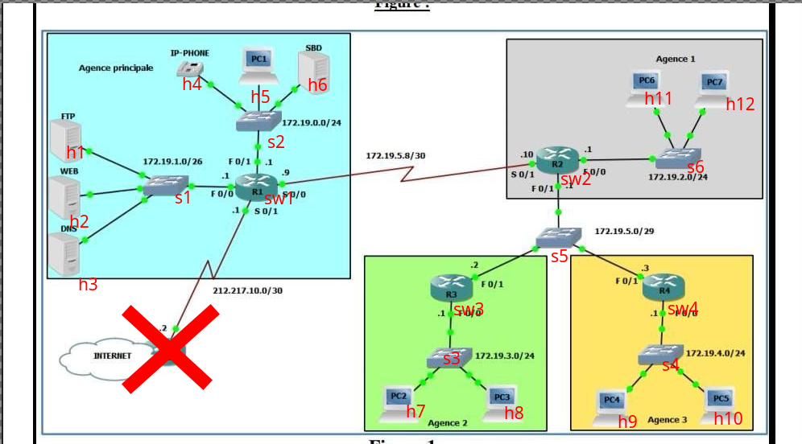

# CSTC SDN dynamic routing with AI 

## Set up :
debian based distros: 
```
  sudo apt update && sudo apt upgrade -y
  sudo apt install mininet python3-pip python3-venv sudo apt install openvswitch-switch -y
  git clone https://github.com/AC-Armitage/CSTC_SDN-AI-Routing
  cd CSTC_SDN-AI-Routing/
  python3 -m venv sdn
  source sdn/bin/activate
  pip install -r requirements.txt
  deactivate
```
## Launching the Test Topology:
Topology:

How to run:
```
  source sdn/bin/activate
  sudo python3 testopo.py
```
#### Make sure to run this when you are done: 
```
  sudo mn -c 
```
